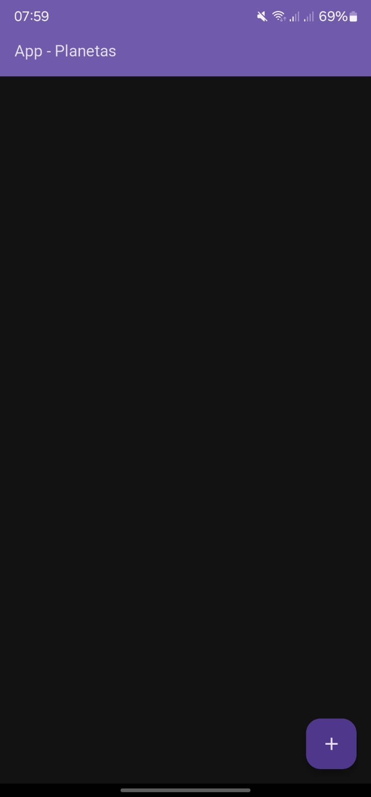
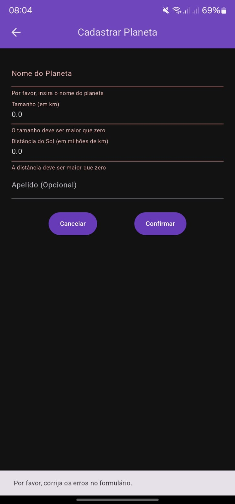
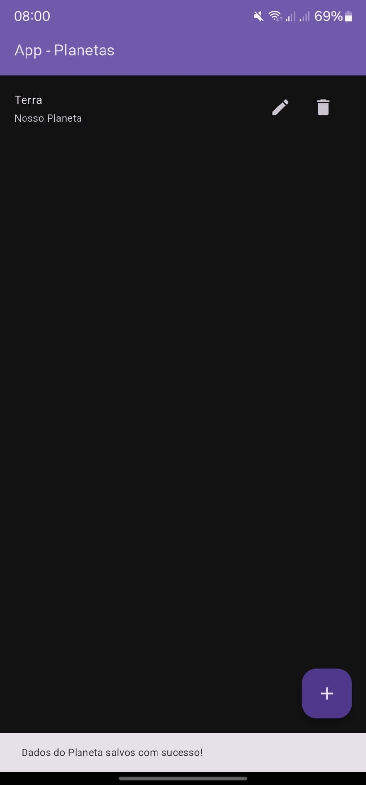

# 🪐 App Planetas - Cadastro de Corpos Celestes 🌍✨  

**App Planetas** é um aplicativo Android simples desenvolvido em **Flutter** (Dart) que permite cadastrar, visualizar, editar e excluir planetas. Ele funciona como um **CRUD**, mantendo os dados armazenados mesmo ao fechar o app.  

📲 **Para baixar e instalar:**  
[➡️ Clique aqui para baixar o APK](app-planetas.apk)  

---

## 🌟 Funcionalidades  

- **Cadastrar novos planetas** com nome, tamanho, distância do Sol e apelido. 
- **Editar informações** de planetas já cadastrados.  
- **Excluir planetas** cadastrados.  
- **Validação de dados** no formulário de cadastro.  
- **Armazenamento local**, mantendo os dados salvos ao fechar o app.  

---

## 📋 Como funciona  

### 🔹 Tela Inicial  
- Exibe a lista de planetas cadastrados.  
- Botão **"+"** para adicionar um novo planeta.  
- Cada planeta tem um **ícone de edição** e um **botão de exclusão**.  

### 🔹 Tela de Cadastro  
- Formulário com os seguintes campos:  
  - **Nome** (obrigatório, mínimo 3 caracteres, apenas letras).  
  - **Tamanho (km)** (obrigatório, apenas números, maior que zero).  
  - **Distância do Sol (km)** (obrigatório, apenas números, maior que zero).  
  - **Apelido** (opcional).  
- Botão **"Cancelar"** para voltar sem salvar.  
- Botão **"Confirmar"** para salvar o planeta.  

⚠️ **Se houver erro nos dados, mensagens em vermelho indicam o problema e o app impede a conclusão do cadastro.**  

### 🔹 Edição de Planetas  
- Ao clicar no **ícone de edição**, abre-se a tela de cadastro preenchida com os dados do planeta.  
- O usuário pode **alterar os dados e salvar** ou cancelar a edição.  

### 🔹 Exclusão  
- O botão **"Excluir"** remove o planeta **imediatamente**, sem confirmação.  

⚠️ **Os dados são salvos localmente e mantidos ao sair do app, mas serão perdidos se o app for desinstalado.**  

---

## 📸 Galeria de Imagens

| 🏠 Tela Inicial  | ➕ Cadastro de Planetas | 📝 Edição de Planetas | 💾 Dados Salvos |
|-----------------|----------------------|----------------|----------------|
|  |  | |  |

---

## 🚀 Instalação  
1. Baixe o arquivo **APK** [aqui](app-planetas.apk).  
2. Instale no seu dispositivo Android.  
3. Abra o app e comece a cadastrar seus planetas!  

